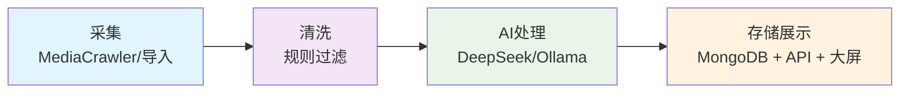

# 🔭 RxSentinel — 处方类灰产情报管线

<div align="center">
  

  # RxSentinel — 处方类灰产情报管线

  **[English](README_EN.md) / [中文](README.md)**

  **在线演示：** [https://derpzhenjun.github.io/RxSentinel/](https://derpzhenjun.github.io/RxSentinel/)
</div>

感谢 **[MediaCrawler](https://github.com/NanmiCoder/MediaCrawler)** 开源项目：`RxSentinel` 内置的 **`MediaCrawler/`** 爬虫子模块来源于此。**请务必同时阅读并遵守该仓库自带的免责声明与用户义务**，使用前以原项目文档为准。

---

## 📖 项目简介

**RxSentinel** 是一套完整的**处方类灰产情报管线系统**。它从多平台爬虫采集或手动导入的社媒评论文本出发，经过规则过滤和**大模型结构化处理**后写入 MongoDB，再用 **Vue 数据大屏**展示，可通过 **Streamlit 调度 UI** 配参并实时监控各阶段执行。

### 🎯 核心价值

- **全链路自动化**：从数据采集到结构化存储的完整管线，一键执行
- **智能去重与更新**：基于指纹识别，同源数据只更新不重复
- **多端实时展示**：API、Web UI、大屏三端同步，支持实时监控

---

## 🎬 项目演示

**系统架构**


**数据大屏**

大屏实时汇总多平台线索、AI 研判与高险实体排行，用于处方类灰产监控指挥。

**在线体验：** [https://derpzhenjun.github.io/RxSentinel/](https://derpzhenjun.github.io/RxSentinel/)（静态演示，数据来自 `extracted_channels.jsonl`）


---

## 🔄 核心流程（四阶段管线）



### 📍 各阶段详解

| 阶段 | 模块 | 功能说明 |
|------|------|----------|
| **1️⃣ 采集** | `MediaCrawler/` | 多平台爬虫采集社媒评论、用户信息；或通过 API 手动导入数据 |
| **2️⃣ 清洗** | `ProcessCdata/data_filter.py` | 基于词库、规则过滤无效数据，去重，格式规范化 |
| **3️⃣ AI处理** | `deepseek_processor.py` / `ollama_processor.py` | 使用 DeepSeek/Ollama 对文本进行结构化提取，生成标准字段 |
| **4️⃣ 存储展示** | `pipeline_runner.py` + API + Vue | 通过 `fingerprint` 去重写入 MongoDB，HTTP API 查询，大屏可视化 |

---

## ✨ 能力一览

| 能力域 | 说明 |
|--------|------|
| **数据采集** | 支持多平台爬虫采集，也可手动导入数据 |
| **智能清洗** | 基于规则过滤无效内容，自动格式化数据 |
| **AI结构化** | 使用大模型将文本转换为标准化的结构化字段 |
| **去重存储** | 通过指纹识别避免重复，灵活选择存储方式 |
| **多端查询** | 提供HTTP API、Streamlit界面和Vue大屏三种访问方式 |
| **实时监控** | Streamlit界面实时显示管线执行状态和日志 |

---

## 🗂️ 仓库结构（核心路径）

| 路径 | 职责 |
|------|------|
| `RxServer/sentinel_api.py` | FastAPI 宿主 |
| `RxServer/routers/` | 路由（健康检查、线索、统计等） |
| `RxServer/sentinel_contract.py` | 入库字段校验、链接/平台名归一、`fingerprint` |
| `RxServer/pipeline_runner.py` | 管线内核与写库侧编排 |
| `RxServer/webui.py` · `webui_core.py` | Streamlit 调度与子进程封装 |
| `ProcessCdata/` | 过滤、DeepSeek/Ollama 处理器、JSON 配置（词库、提示词等） |
| `SentinelDashboard/` | 大屏前端（独立 npm 依赖） |
| `MediaCrawler/` | 多平台爬虫子工程（独立 `requirements.txt`；可选用 uv，见该目录 README） |
| `tests/` | 单元 / 端到端 / 集成测试目录 |
| `start.py` | 本地一键拉起 API / Streamlit / 前端 dev |

---

## 🚀 快速开始

### 前置依赖

| 依赖 | 版本 |
|------|------|
| Python | 3.12 |
| Node.js | 20 |
| MongoDB | 本地或远程实例，供完整读写链路使用 |

**1. 创建并激活 Conda 环境**

```bash
conda create -n rxsentinel python=3.12 -y
conda activate rxsentinel
```

**2. 安装 Node.js 20**

若本机尚未安装，任选一种方式：

```bash
conda install -c conda-forge nodejs=20 -y
```

验证：

```bash
node --version
npm --version
```

`node --version` 应输出 `v20.x.x`。

**3. MongoDB**

安装并启动 MongoDB，连接信息稍后写入根目录 `.env` 中的 `MONGODB_*` 变量。

仅跑爬虫阶段时，请在 **`MediaCrawler/`** 内按 **[MediaCrawler](https://github.com/NanmiCoder/MediaCrawler)** 文档安装浏览器、Playwright 或 CDP 等。

### 安装依赖

激活 Conda 环境后，在项目根目录执行：

```bash
pip install -r requirements.txt
```

### 配置

**后端 — 项目根目录**

```bash
cp .env.example .env
```

Windows CMD：

```cmd
copy .env.example .env
```

编辑 `.env`，至少配置：

| 变量 | 说明 |
|------|------|
| `MONGODB_URI` | MongoDB 连接地址 |
| `MONGODB_DB` | 数据库名 |
| `MONGODB_COLLECTION` | 集合名 |
| `API_SECRET_KEY` | API 鉴权密钥；生产环境务必设置，留空为开发免鉴权 |

完整说明见 `.env.example`。

**大屏 — `SentinelDashboard/`**

```bash
cp SentinelDashboard/.env.example SentinelDashboard/.env
```

Windows CMD：

```cmd
copy SentinelDashboard\.env.example SentinelDashboard\.env
```

编辑 `SentinelDashboard/.env`：`VITE_API_BASE_URL` 指向后端地址，`VITE_API_SECRET` 与根目录 `API_SECRET_KEY` 保持一致。

### 运行

在项目根目录执行：

```bash
python start.py
```

启动后可访问：

| 服务 | 地址 |
|------|------|
| API | http://127.0.0.1:8000 |
| Streamlit | http://localhost:8501 |
| 大屏 | http://localhost:5173 |

通过 `start.py` 拉起 API 时，日志默认写入仓库根目录 **`sentinel_api.log`**。

### 使用内置验证测试集

适合刚完成安装、尚未配置爬虫时，快速体验 **AI 结构化 → 大屏展示** 全链路，无需真实采集与清洗。

1. 按上文启动 `python start.py`，打开 Streamlit：http://localhost:8501  
2. 在左侧边栏 **⚙️ 全局参数配置** 勾选：
   - **使用内置验证测试数据集** — 跳过采集/清洗，安装合成 `filtered_comments.jsonl` 后直接执行 AI → 大屏合并  
   - 可选：**安装验证集前备份现有 filtered_comments.jsonl** — 覆盖前将原文件备份为 `.bak_demo_verify`  
3. **目标平台** 默认包含 bili / xhs / zhihu / douyin / tieba / weibo，可按需增删  
4. 在 Streamlit 主界面启动管线

说明：

- 内置样本位于 `ProcessCdata/data/_demo_verify/`；预期结果对照 `ProcessCdata/data/_demo_verify/demo_verify_expectations.json`  
- 验证集模式下，爬虫/清洗/存储与读取及大屏合并固定为 **只存本地、从本地读**，中间结果 **不入 Mongo**  
- 若某平台已有 `ai_extracted_channels.jsonl`，将 **跳过 AI** 以节省 API token；需重跑时在「覆盖 AI 分析」中勾选对应平台  
- 大屏默认请求 Mongo API；若与本地合并文件不一致，请在 `SentinelDashboard/.env` 设置 `VITE_USE_JSONL_FIRST=true` 并重启大屏 dev 服务

<details>
<summary>📎 <strong>单独运行 MediaCrawler</strong></summary>

`uv sync`、`main.py` 参数、`uvicorn api.main:app` 等均以 **`MediaCrawler/README.md`** 为准；根目录 **`pip`** 依赖与爬虫子工程的依赖互不替代。

</details>

---

## 免责声明

本项目仅供学习与交流；爬虫与数据处理须遵守法律法规及平台协议。RxSentinel 使用了 **[NanmiCoder / MediaCrawler](https://github.com/NanmiCoder/MediaCrawler)** 的实现思路与代码，**再次感谢原作者的开源贡献**；**关于爬虫、版权声明与免责声明的完整内容，请以 MediaCrawler 官方仓库文档为准并由使用者自行承担相应责任**。
