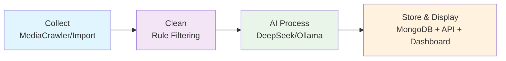

# 🔭 RxSentinel — Prescription gray-market intelligence pipeline

<div align="center">
  

  # RxSentinel — Prescription gray-market intelligence pipeline

  **[English](README_EN.md) / [中文](README.md)**
</div>

Thanks to the open-source project **[MediaCrawler](https://github.com/NanmiCoder/MediaCrawler)**: the **`MediaCrawler/`** crawler submodule bundled in RxSentinel comes from it. **Please be sure to read and comply with the disclaimer and user obligations included in that repository**, treat the upstream project documentation as authoritative before use.

---

## 📖 Project Overview

**RxSentinel** is a complete **prescription gray-market intelligence pipeline system**. It starts from social media comment text collected via multi-platform crawlers or manual import, goes through rule-based filtering and **large language model structured processing**, writes to MongoDB, and displays on a **Vue data dashboard**, configurable and monitored in real-time via a **Streamlit scheduling UI**.

### 🎯 Core Value

- **End-to-end automation**: Complete pipeline from data collection to structured storage, one-click execution
- **Smart deduplication and update**: Fingerprint-based identification, same-source data updates without duplication
- **Multi-platform real-time display**: API, Web UI, dashboard three-end sync, supporting real-time monitoring

## 🔄 Core Process (Four-Stage Pipeline)



### 📍 Stage Details

| Stage | Module | Function Description |
|-------|--------|----------------------|
| **1️⃣ Collect** | `MediaCrawler/` | Multi-platform crawler collects social media comments and user info; or manual data import via API |
| **2️⃣ Clean** | `ProcessCdata/data_filter.py` | Rule and lexicon-based filtering of invalid data, deduplication, format normalization |
| **3️⃣ AI Process** | `deepseek_processor.py` / `ollama_processor.py` | Use DeepSeek/Ollama for structured extraction from text, generate standard fields |
| **4️⃣ Store & Display** | `pipeline_runner.py` + API + Vue | Deduplicate via `fingerprint` and write to MongoDB, HTTP API query, dashboard visualization |

---

## 🔧 Technical Highlights

- **Backend**: FastAPI (`RxServer/sentinel_api.py`), routes in `RxServer/routers/`, optional Token protection and slowapi rate limiting.  
- **Data Ingestion**: Field validation via Pydantic; links and platform names unified formatting; **`RxServer/sentinel_contract.py`** handles these rules and **`fingerprint`**.  
- **Pipeline**: Optional crawl **`MediaCrawler/`** → `ProcessCdata/data_filter.py` cleaning → `deepseek_processor.py` / `ollama_processor.py` LLM extraction → `RxServer/pipeline_runner.py` merge write to DB or export JSONL.  
- **Scheduling**: Streamlit (`RxServer/webui.py`) with `webui_core.py` for subprocess spawning.  
- **Dashboard**: `SentinelDashboard/` (Vite + Vue 3, Pinia, DataV, ECharts); reads offline **JSONL** when API unavailable.  
- **One-click Local**: Root **`python start.py`** starts API, Streamlit, optional frontend dev simultaneously.

**Optional Images** (not in main text, place in **`docs/assets/`** as needed): Architecture diagram **`architecture.png`** (Type: **System Architecture Diagram**), Full process **`pipeline-flow.png`** (Type: **Flow Diagram**), Dashboard **`dashboard-demo.gif`** (Type: **Demo GIF**), Streamlit **`streamlit-webui.png`** (Type: **Interface Screenshot**).

---

## ✨ Capabilities Overview

| Capability Area | Description |
|-----------------|-------------|
| **Data Collection** | Supports multi-platform crawler collection, also manual data import |
| **Smart Cleaning** | Rule-based filtering of invalid content, automatic data formatting |
| **AI Structuring** | Use large models to convert text into standardized structured fields |
| **Deduplication Storage** | Fingerprint recognition to avoid duplicates, flexible storage options |
| **Multi-platform Query** | Provides HTTP API, Streamlit interface, and Vue dashboard three access methods |
| **Real-time Monitoring** | Streamlit interface displays pipeline execution status and logs in real-time |

---

## 🗂️ Repository Structure (Core Paths)

| Path | Responsibility |
|------|----------------|
| `RxServer/sentinel_api.py` | FastAPI host |
| `RxServer/routers/` | Routes (health check, leads, stats, etc.) |
| `RxServer/sentinel_contract.py` | Ingestion field validation, link/platform name normalization, `fingerprint` |
| `RxServer/pipeline_runner.py` | Pipeline kernel and write-side orchestration |
| `RxServer/webui.py` · `webui_core.py` | Streamlit scheduling and subprocess encapsulation |
| `ProcessCdata/` | Filtering, DeepSeek/Ollama processors, JSON configs (lexicons, prompts, etc.) |
| `SentinelDashboard/` | Dashboard frontend (independent npm dependencies) |
| `MediaCrawler/` | Multi-platform crawler sub-project (independent `requirements.txt`; uv optional, see README) |
| `tests/` | Unit / e2e / integration test directories |
| `start.py` | One-click local launch of API / Streamlit / frontend dev |

---

## 🚀 Quick Start

### Prerequisites

- **Python 3.10+** (as per local environment)  
- **Node.js + npm** (dashboard)  
- **MongoDB** (full read-write chain)  

For crawling stage only, install browser, Playwright, or CDP in **`MediaCrawler/`** per **[MediaCrawler](https://github.com/NanmiCoder/MediaCrawler)** documentation.

### Installation

```bash
pip install -r requirements.txt
pip install -r MediaCrawler/requirements.txt   # only when crawling stage is needed
pip install -r requirements-test.txt         # lightweight dependencies for pytest only, see file header
```

### Configuration

1. Root: `cp .env.example .env` (Windows: `copy .env.example .env`), fill **`MONGODB_*`**, `API_SECRET_KEY` (must set in production; empty for dev no-auth). See `.env.example` for details.  
2. Dashboard: `SentinelDashboard/.env.example` → `SentinelDashboard/.env`, **`VITE_API_BASE_URL`** and **`VITE_API_SECRET`** match backend.

### Run (Recommended)

```bash
python start.py
```

- API: `http://127.0.0.1:8000`  
- Streamlit: `http://localhost:8501`  
- Dashboard dev: `http://localhost:5173`  

Others: `python start.py --help` (e.g., `--api-only`, `--no-frontend`).

**API Only**

```bash
python RxServer/sentinel_api.py --host 127.0.0.1 --port 8000
```

**Dashboard Only** (backend must be reachable)

```bash
cd SentinelDashboard && npm install && npm run dev
```

When starting API via `start.py`, logs are written to repo root **`sentinel_api.log`** by default.

<details>
<summary>📎 <strong>Running MediaCrawler Alone</strong></summary>

`uv sync`, `main.py` params, `uvicorn api.main:app`, etc., follow **`MediaCrawler/README.md`**; root **`pip`** dependencies do not replace crawler sub-project dependencies.

</details>

---

## Disclaimer

This project is for learning and communication only; crawling and data processing must comply with laws and platform terms. RxSentinel uses the implementation ideas and code subtree from **[NanmiCoder / MediaCrawler](https://github.com/NanmiCoder/MediaCrawler)**, **thank you again to the original authors for their open-source contributions**; **for complete content on crawling, copyright notices, and disclaimers, follow the official MediaCrawler repository documentation and users bear their own responsibilities**.
