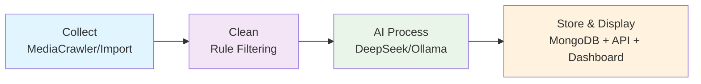

# 🔭 RxSentinel — Prescription gray-market intelligence pipeline

<div align="center">
  

  # RxSentinel — Prescription gray-market intelligence pipeline

  **[English](README_EN.md) / [中文](README.md)**

  **Live demo:** [https://derpzhenjun.github.io/RxSentinel/](https://derpzhenjun.github.io/RxSentinel/)
</div>

Thanks to the open-source project **[MediaCrawler](https://github.com/NanmiCoder/MediaCrawler)**: the **`MediaCrawler/`** crawler submodule bundled in RxSentinel comes from it. **Please be sure to read and comply with the disclaimer and user obligations included in that repository**, treat the upstream project documentation as authoritative before use.

---

## 📖 Project Overview

**RxSentinel** is a complete **prescription gray-market intelligence pipeline system**. It starts from social media comment text collected via multi-platform crawlers or manual import, goes through rule-based filtering and **large language model structured processing**, writes to MongoDB, and displays on a **Vue data dashboard**, configurable and monitored in real-time via a **Streamlit scheduling UI**.

### 🎯 Core Value

- **End-to-end automation**: Complete pipeline from data collection to structured storage, one-click execution
- **Smart deduplication and update**: Fingerprint-based identification, same-source data updates without duplication
- **Multi-platform real-time display**: API, Web UI, dashboard three-end sync, supporting real-time monitoring

---

## 🎬 Project Demo

**System architecture**


**Data dashboard**

The dashboard aggregates multi-platform leads, AI analysis, and high-risk entity rankings for prescription gray-market monitoring.

**Try it live:** [https://derpzhenjun.github.io/RxSentinel/](https://derpzhenjun.github.io/RxSentinel/) (static demo powered by `extracted_channels.jsonl`)


---

## 🔄 Core Process (Four-Stage Pipeline)



### 📍 Stage Details

| Stage | Module | Function Description |
|-------|--------|----------------------|
| **1️⃣ Collect** | `MediaCrawler/` | Multi-platform crawler collects social media comments and user info; or manual data import via API |
| **2️⃣ Clean** | `ProcessCdata/data_filter.py` | Rule and lexicon-based filtering of invalid data, deduplication, format normalization |
| **3️⃣ AI Process** | `deepseek_processor.py` / `ollama_processor.py` | Use DeepSeek/Ollama for structured extraction from text, generate standard fields |
| **4️⃣ Store & Display** | `pipeline_runner.py` + API + Vue | Deduplicate via `fingerprint` and write to MongoDB, HTTP API query, dashboard visualization |

---

## ✨ Capabilities Overview

| Capability Area | Description |
|-----------------|-------------|
| **Data Collection** | Supports multi-platform crawler collection, also manual data import |
| **Smart Cleaning** | Rule-based filtering of invalid content, automatic data formatting |
| **AI Structuring** | Use large models to convert text into standardized structured fields |
| **Deduplication Storage** | Fingerprint recognition to avoid duplicates, flexible storage options |
| **Multi-platform Query** | Provides HTTP API, Streamlit interface, and Vue dashboard three access methods |
| **Real-time Monitoring** | Streamlit interface displays pipeline execution status and logs in real-time |

---

## 🗂️ Repository Structure (Core Paths)

| Path | Responsibility |
|------|----------------|
| `RxServer/sentinel_api.py` | FastAPI host |
| `RxServer/routers/` | Routes (health check, leads, stats, etc.) |
| `RxServer/sentinel_contract.py` | Ingestion field validation, link/platform name normalization, `fingerprint` |
| `RxServer/pipeline_runner.py` | Pipeline kernel and write-side orchestration |
| `RxServer/webui.py` · `webui_core.py` | Streamlit scheduling and subprocess encapsulation |
| `ProcessCdata/` | Filtering, DeepSeek/Ollama processors, JSON configs (lexicons, prompts, etc.) |
| `SentinelDashboard/` | Dashboard frontend (independent npm dependencies) |
| `MediaCrawler/` | Multi-platform crawler sub-project (independent `requirements.txt`; uv optional, see README) |
| `tests/` | Unit / e2e / integration test directories |
| `start.py` | One-click local launch of API / Streamlit / frontend dev |

---

## 🚀 Quick Start

### Prerequisites

| Dependency | Version |
|------------|---------|
| Python | 3.12 |
| Node.js | 20 |
| MongoDB | Local or remote instance for the full read-write pipeline |

**1. Create and activate a Conda environment**

```bash
conda create -n rxsentinel python=3.12 -y
conda activate rxsentinel
```

**2. Install Node.js 20**

If not already installed, use either approach:

```bash
conda install -c conda-forge nodejs=20 -y
```

Verify:

```bash
node --version
npm --version
```

`node --version` should print `v20.x.x`.

**3. MongoDB**

Install and start MongoDB; connection details go in the root `.env` under `MONGODB_*`.

For the crawl stage only, install browser, Playwright, or CDP in **`MediaCrawler/`** per **[MediaCrawler](https://github.com/NanmiCoder/MediaCrawler)** documentation.

### Install dependencies

With the Conda environment active, from the project root:

```bash
pip install -r requirements.txt
```

### Configuration

**Backend — project root**

```bash
cp .env.example .env
```

Windows CMD:

```cmd
copy .env.example .env
```

Edit `.env` and set at minimum:

| Variable | Description |
|----------|-------------|
| `MONGODB_URI` | MongoDB connection URI |
| `MONGODB_DB` | Database name |
| `MONGODB_COLLECTION` | Collection name |
| `API_SECRET_KEY` | API auth secret; required in production, leave empty for dev no-auth |

See `.env.example` for full details.

**Dashboard — `SentinelDashboard/`**

```bash
cp SentinelDashboard/.env.example SentinelDashboard/.env
```

Windows CMD:

```cmd
copy SentinelDashboard\.env.example SentinelDashboard\.env
```

Edit `SentinelDashboard/.env`: set `VITE_API_BASE_URL` to the backend URL and `VITE_API_SECRET` to match root `API_SECRET_KEY`.

### Run

From the project root:

```bash
python start.py
```

After startup:

| Service | URL |
|---------|-----|
| API | http://127.0.0.1:8000 |
| Streamlit | http://localhost:8501 |
| Dashboard | http://localhost:5173 |

When the API is started via `start.py`, logs are written to **`sentinel_api.log`** at the repo root by default.

### Using the built-in verification test dataset

Use this right after install when crawlers are not set up yet — a quick end-to-end path through **AI structuring → dashboard**, without real collection or filtering.

1. Start with `python start.py` as above, then open Streamlit: http://localhost:8501  
2. In the left sidebar under **⚙️ Global parameters**, enable:
   - **Use built-in verification test dataset** — skips crawl/filter, installs synthetic `filtered_comments.jsonl`, then runs AI → dashboard merge  
   - Optional: **Back up existing filtered_comments.jsonl before installing the verification set** — saves the previous file as `.bak_demo_verify` before overwrite  
3. **Target platforms** default to bili / xhs / zhihu / douyin / tieba / weibo; add or remove as needed  
4. Start the pipeline from the main Streamlit panel

Notes:

- Sample data lives under `ProcessCdata/data/_demo_verify/`; expected outcomes are in `ProcessCdata/data/_demo_verify/demo_verify_expectations.json`  
- In verification mode, crawl/filter/storage/read and dashboard merge are fixed to **local files only** — intermediate results are **not written to MongoDB**  
- If a platform already has `ai_extracted_channels.jsonl`, **AI is skipped** to save API tokens; to re-run AI, select that platform under overwrite options for AI analysis  
- The dashboard requests the Mongo API by default; if it does not match local merged JSONL, set `VITE_USE_JSONL_FIRST=true` in `SentinelDashboard/.env` and restart the dashboard dev server

<details>
<summary>📎 <strong>Running MediaCrawler Alone</strong></summary>

`uv sync`, `main.py` params, `uvicorn api.main:app`, etc., follow **`MediaCrawler/README.md`**; root **`pip`** dependencies do not replace crawler sub-project dependencies.

</details>

---

## Disclaimer

This project is for learning and communication only; crawling and data processing must comply with laws and platform terms. RxSentinel uses the implementation ideas and code from **[NanmiCoder / MediaCrawler](https://github.com/NanmiCoder/MediaCrawler)**, **thank you again to the original authors for their open-source contributions**; **for complete content on crawling, copyright notices, and disclaimers, follow the official MediaCrawler repository documentation and users bear their own responsibilities**.
